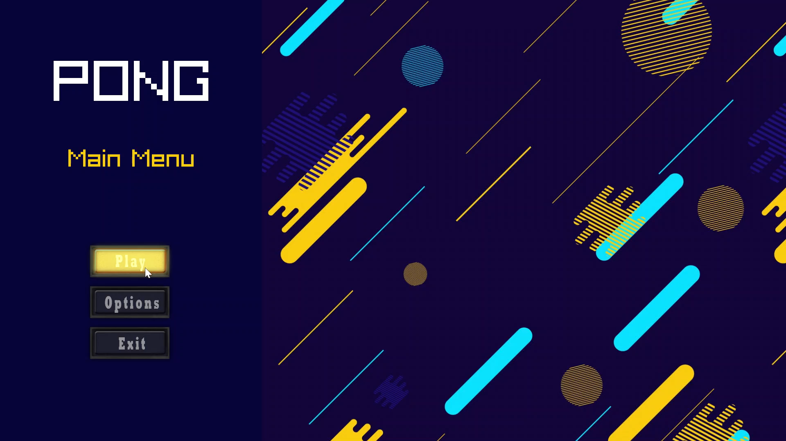
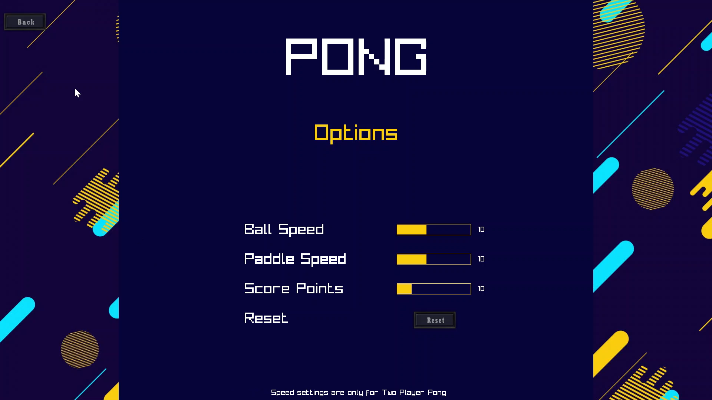
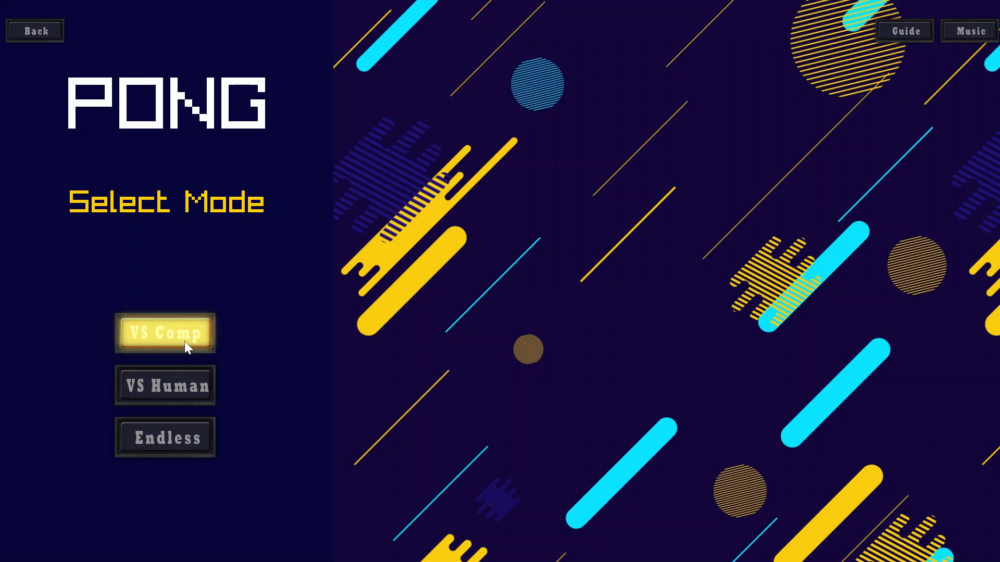
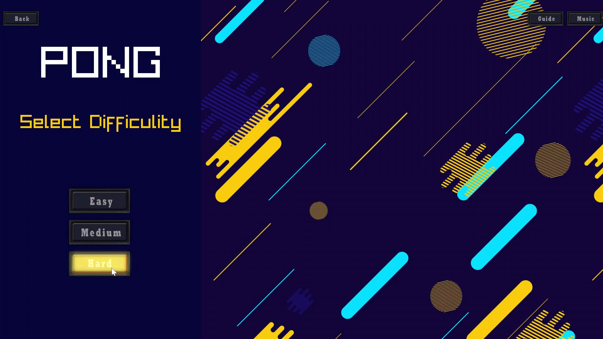
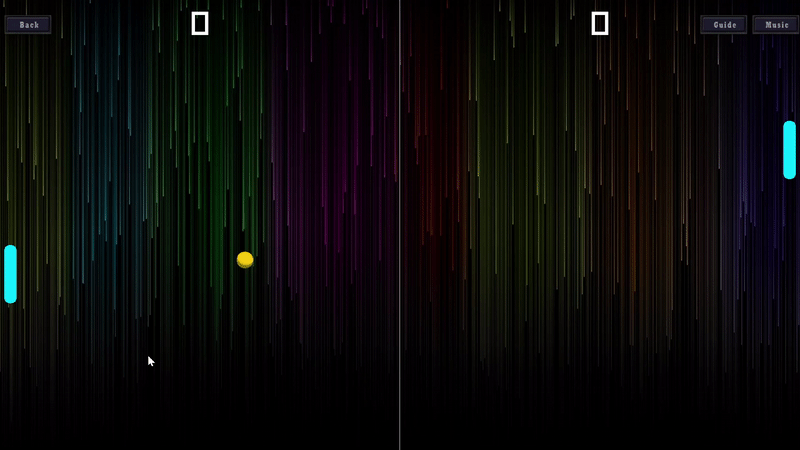

# Pong Game

Welcome to the Pong Game, a classic arcade experience implemented in C++ using the fantastic [Raylib](https://www.raylib.com/) and [Raygui](https://www.raylib.com/raygui/) libraries.

## Table of Contents

- [Features](#features)
- [System Requirements](#system-requirements)
- [Installation](#installation)
- [How to Play](#how-to-play)
- [Controls](#controls)
- [Screenshots](#screenshots)
- [Contributing](#contributing)
- [License](#license)

## Features

- *Game Modes:*
  - Versus Computer
  - Versus Human
  - Endless
  
- *Difficulty Levels:*
  - Easy
  - Medium
  - Hard
  
- *Audio Experience:*
  - Background Music
  - Sound Effects

- *Customization Options:*
  - Ball and Paddle Speed Adjustment
  - Score Adjustment

- *User Interaction:*
  - Pause Game
  - In-Game Guide
  - Pause Music

- *Visual Appeal:*
  - Cool Button Animations
  - Cool Slider Animations

## System Requirements

- *For Code Editing:*
  - Install [Raylib](https://www.raylib.com/) library

- *To Play the Game:*
  - Minimum Display Resolution: 1080p

## Installation

1. *Clone the repository:*
    
    bash
    git clone https://github.com/ibtasamali04/PongGame.git
    
    
3. *Navigate to the project directory:*

    bash
    cd PongGame
    

4. *Build the game using your preferred C++ compiler.*

5. *Run the executable generated.*

## How to Play

- Launch the game executable.

- Choose the game mode (Versus Computer, Versus Human, Endless) and difficulty level (Easy, Medium, Hard).

- Use the controls to move your paddle and compete against your opponent or the computer.

- Enjoy the game with customizable options and cool button animations.

## Controls

- *Player 1:*
  - Up: Up Arrow
  - Down: Down Arrow
- *Player 2:*
  - Up: W
  - Down: S
- *Pause:*
  - P
- *Navigate Menu:*
  - Mouse Movement
- *Select:*
  - Left Click
 
## Screenshots

- *Start Window*  

- *Options Window*

- *Mode Window*

- *Dificulty Window*

- Game*

## Contributing

If you'd like to contribute to the project, please fork the repository and submit a pull request. Issues and feature requests are welcome too!

## License

This project is licensed under the [MIT License](LICENSE). Feel free to use, modify, and distribute the code!
